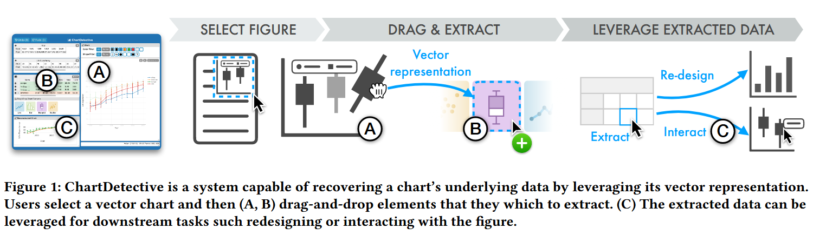
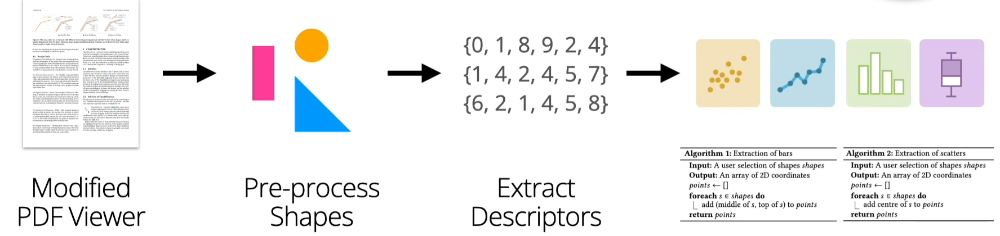

# **Reflection 8**
# Title: ChartDetective: Easy and Accurate Interactive Data Extraction from Complex Vector Charts
Authors: Damien Masson, Sylvain Malacria, Daniel Vogel, Edward Lank, Géry Casiez

1. [ChartDetective: Easy and Accurate Interactive Data Extraction from Complex Vector Charts](https://dl.acm.org/doi/pdf/10.1145/3544548.3581113)

**Paper's Contribution:** 

The paper proposes a semi-automatic approach for extracting underlying data from charts leveraging underlying vector representation. Author makes distinction between vector based approach and raster images by highlighting drawbacks of raster based images. Author implements a tool that will enable its users to select and extract data with high accuracy that is validated by two studies (Usability sutdy and Data quality study.)

**Why vector based?** 
Vector images, defined by mathematical equations, offer limitless scalability and maintain quality, making them ideal for precision-required designs like logos and charts. Raster images, made up of a pixel grid, are suitable for detailed photographs but can pixelate when resized, affecting their utility in scalable applications.

Figure 1: Tool and its user interface

# **Data Extraction Method:**

The extraction of data from PDFs is done as follows:

**Access Vector Specifications:** Uses PDF.js modifications to extract vector graphics commands from PDFs, accessing detailed shape information for precise data extraction.

**Pixel-Perfect Selection:** Employs a dual-rendering strategy with a "hit-test buffer" for accurate, pixel-perfect selection of chart elements based on unique color assignments.

**Shape Filtering:** Implements color and shape filters to simplify the selection process in dense or complex charts, enhancing user efficiency and accuracy.

**Data Extraction:** Automatically extracts numerical data from selected vector chart elements, translating graphical representations back into data points.

**Verification and Adjustment:** Features a reconstructed chart view for visual comparison between original and extracted data, allowing users to adjust for accuracy.

Figure 2: Data extraction process

**References:**

1. [ChartDetective: Easy and Accurate Interactive Data Extraction from Complex Vector Charts](https://dl.acm.org/doi/pdf/10.1145/3544548.3581113)
