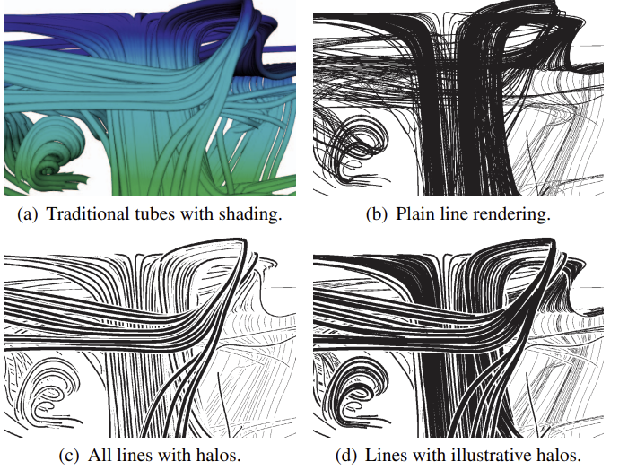

# Week 8 Reflection

## Source

[Depth-Dependent Halos: Illustrative Rendering of Dense Line Data](https://www.researchgate.net/publication/38015460_Depth-Dependent_Halos_Illustrative_Rendering_of_Dense_Line_Data)
 
 
	M. H. Everts, H. Bekker, J. B. T. M. Roerdink, and T. Isenberg, “Depth-Dependent Halos: Illustrative Rendering of Dense Line Data,” IEEE Transactions on Visualization and Computer Graphics, vol. 15, no. 6, pp. 1299–1306, Nov. 2009, doi: 10.1109/TVCG.2009.138.

## Reflection

I thought this was an interesting paper talking about visualizing /
rendering dense line data.

The paper suggests a technique, specifically rendering halos on
line data based on the depth of a line in 3d space to illustrate
the line data two dimensionally.

Their main goal is to increase depth perception and streamline
visualization, specifically black-and-white visualizations for
dense datasets.

They use techniques to align the data based on a chosen 
viewing direction, and calculate whether halos should or should
not be rendered based on multiple factors, including visibility
from the view direction, and proximity to other lines (lines that
are proximate enough to each other do not render overlapping halos).

They follow principles that allow them to emphasize bundles of lines
in their visualizations using the aforementioned techniques.

They also use a depth cueing technique to render the lines and
halos in perspective.

To enable an even greater 3D effect, the researchers also created
a way to encode the visualization with red-blue data from multiple
perspectives, enabling a 3d viewing experience with 3d red and blue
glasses.

The paper talks about different applications of these visualizations
including illustrating DTI Fiber Tracts (a technique used to
reconstruct and assess neural tracts) as well as gas and fluid flow
simulations.

They believe that this technique is most applicable to depicting
paths of linear structures, or for flow visualization.

They also speak about how this technique can extend to point data,
and evaluate their visualizations with domain experts in
neurosurgery and tractography.

These experts were impressed with the illustrations, and believed
that they were very indicative of the underlying structure.

I think that overall this research is interesting and definitely has
some cool applications.

I also think that the visualizations created from this technique
are all very beautiful to look at and could make some really cool
artwork as well.

 
Comparison of Different Techniques
 
 
 

 
Red-Blue Encoded Visualization
 
 
 

 
DTI Fiber Tracts Visualization
