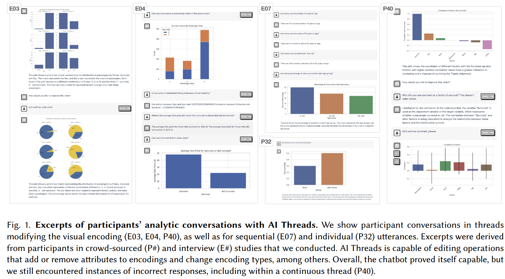

# **Reflection 9**
# Title: Conversational AI Threads for Visualizing Multidimensional Datasets
Authors: 

MATT-HEUN HONG, University of North Carolina, USA 

ANAMARIA CRISAN, Tableau Research, USA

1. [Conversational AI Threads for Visualizing Multidimensional Datasets](https://arxiv.org/pdf/2311.05590.pdf)

**Paper's Contribution:** 

The paper demonstrates the potential of Large Language Models (LLMs) in enhancing data vis and analysis through the development of multi-threaded conversational AI chatbot that retains conversation chain and context. )

# **Methodology**

- LLM for visualizing multidimensional dataset through conversational interface. Authors conducts usablity studies with crowdsourced (40 participants) and experts (10 analysts). 

# **AI Thread**

- Chat bot is designed to handle conversation and retain it for context. 

# **Use Case**

- Authors used Military dataset on Kaggle from Armed Forces of Ukraine that tracks cumulative Russian losses in terms of personnel and equipment.  

# **Analysis from Experts**

- Authors state that experts emphasized the chatbot's role in streamlining exploratory data analysis and that more feature development should be done for complex data workflows. 

**References:**

1. [Conversational AI Threads for Visualizing Multidimensional Datasets](https://arxiv.org/pdf/2311.05590.pdf)